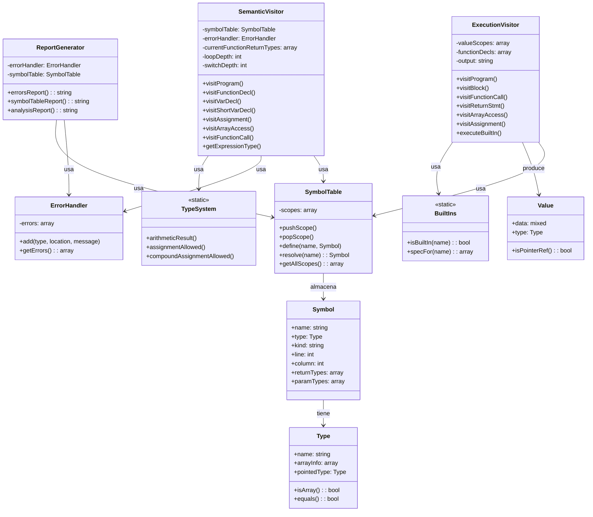
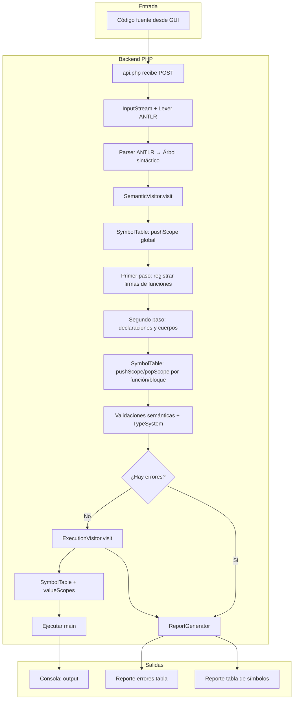
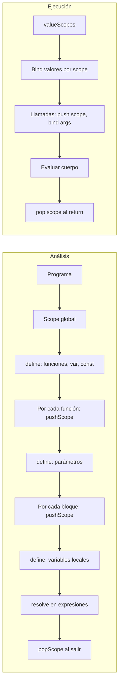

# Documentación Técnica — Golampi Interpreter

**Proyecto:** Intérprete del lenguaje Golampi  
**Versión:** 1.0  
**Fecha:** [Completar según entrega]

---

## 1. Gramática formal de Golampi

La gramática se define en notación BNF equivalente a la utilizada en ANTLR4. El analizador léxico y sintáctico se generan a partir del archivo `backend/grammar/Golampi.g4`.

### 1.1 Programa y declaraciones de nivel superior

```bnf
program         ::= topLevelDecl* EOF

topLevelDecl    ::= varDecl | constDecl | functionDecl
```

### 1.2 Tipos

```bnf
type            ::= baseType | arrayType | pointerType

baseType        ::= 'int32' | 'int' | 'float32' | 'bool' | 'rune' | 'string'

arrayType       ::= '[' expression ']' type

pointerType     ::= '*' type
```

### 1.3 Declaraciones

```bnf
varDecl         ::= 'var' identifierList type ('=' expressionList)?

shortVarDecl    ::= identifierList ':=' expressionList

constDecl       ::= 'const' IDENTIFIER type '=' expression

identifierList  ::= IDENTIFIER (',' IDENTIFIER)*

expressionList  ::= expression (',' expression)* ','?
```

### 1.4 Funciones

```bnf
functionDecl    ::= 'func' IDENTIFIER '(' parameters? ')' returnType? block

parameters      ::= parameter (',' parameter)*

parameter       ::= IDENTIFIER type

returnType      ::= type | '(' type (',' type)* ')'
```

### 1.5 Bloques y sentencias

```bnf
block           ::= '{' statement* '}'

statement       ::= varDecl | shortVarDecl | constDecl | assignment
                  | incDecStmt | ifStmt | switchStmt | forStmt
                  | breakStmt | continueStmt | returnStmt
                  | expressionStmt | block
```

### 1.6 Asignaciones e incrementos

```bnf
assignment      ::= expression assignOp expression

expressionStmt  ::= expression

assignOp        ::= '=' | '+=' | '-=' | '*=' | '/='

incDecStmt      ::= expression ('++' | '--')
```

### 1.7 Estructuras de control

```bnf
ifStmt          ::= 'if' ( simpleStmt ';' )? expression block
                    ( 'else' ( ifStmt | block ) )?

switchStmt      ::= 'switch' expression '{' caseClause* defaultClause? '}'

caseClause      ::= 'case' expressionList ':' statement*

defaultClause   ::= 'default' ':' statement*

forStmt         ::= 'for' forClause block
                  | 'for' expression block
                  | 'for' block

forClause       ::= ( simpleStmt )? ';' ( expression )? ';' ( simpleStmt )?

simpleStmt      ::= shortVarDecl | varDecl | assignment | incDecStmt | expressionStmt
```

### 1.8 Sentencias de transferencia

```bnf
breakStmt       ::= 'break'

continueStmt    ::= 'continue'

returnStmt      ::= 'return' expressionList?
```

### 1.9 Expresiones (precedencia de menor a mayor)

```bnf
expression      ::= logicalOr

logicalOr       ::= logicalAnd ( '||' logicalAnd )*

logicalAnd      ::= equality ( '&&' equality )*

equality        ::= comparison ( ( '==' | '!=' ) comparison )*

comparison      ::= addition ( ( '>' | '>=' | '<' | '<=' ) addition )*

addition        ::= multiplication ( ( '+' | '-' ) multiplication )*

multiplication  ::= unary ( ( '*' | '/' | '%' ) unary )*

unary           ::= ( '!' | '-' | '*' | '&' ) unary | primary
```

### 1.10 Primarios, arreglos y llamadas

```bnf
primary         ::= literal | arrayLiteral | functionCall
                  | qualifiedIdentifier | arrayAccess
                  | '(' expression ')'

arrayAccess     ::= qualifiedIdentifier ('[' expression ']')+

arrayLiteral    ::= arrayType arrayLiteralBody

arrayLiteralBody    ::= '{' arrayElementList? '}'

arrayElementList    ::= arrayElement (',' arrayElement)* ','?

arrayElement    ::= expression | arrayLiteralBody

functionCall    ::= qualifiedIdentifier '(' argumentList? ')'

argumentList    ::= expression (',' expression)*

qualifiedIdentifier ::= IDENTIFIER ('.' IDENTIFIER)*
```

### 1.11 Literales y léxico

```bnf
literal         ::= INT_LITERAL | FLOAT_LITERAL | STRING_LITERAL
                  | RUNE_LITERAL | 'true' | 'false' | 'nil'

IDENTIFIER      ::= [_a-zA-Z][_a-zA-Z0-9]*
INT_LITERAL     ::= [0-9]+
FLOAT_LITERAL   ::= [0-9]+ '.' [0-9]+ ([eE][+-]?[0-9]+)?
STRING_LITERAL  ::= '"' ( ~["\\] | '\\' . )* '"'
RUNE_LITERAL    ::= '\'' ( ~['\\] | '\\' . ) '\''
```

Comentarios y espacios: `//` línea, `/* */` bloque; `WS` se omite.

---

## 2. Diagrama de clases

A continuación se describe la arquitectura de clases del backend (PHP) y la relación con el frontend.

### 2.1 Backend (PHP)



### 2.2 Frontend (HTML/JS)

El frontend no utiliza clases formales; está implementado en un único documento HTML con JavaScript inline (o [archivos JS externos si los hay]). Los elementos principales son:

- **Editor:** `<textarea id="editor">` — Código fuente.
- **Consola:** `<div id="console">` — Salida y tabla de errores.
- **Handlers:** Funciones `setConsole()`, `apiUrl()`, `download()`, y manejadores de clic para cada botón de la barra de acciones y del panel de reportes.
- **Comunicación:** `fetch(apiUrl(), { method: 'POST', body: JSON.stringify({ code }) })` hacia el backend.

[Completar si se añaden módulos JS o componentes reutilizables.]

---

## 3. Diagrama de flujo de procesamiento

Flujo desde la entrada del código hasta la ejecución y generación de reportes, con énfasis en la tabla de símbolos.



### 3.1 Flujo de la tabla de símbolos



---

## 4. Descripción de los módulos del sistema

| Módulo | Ubicación | Responsabilidad |
|--------|-----------|-----------------|
| **Léxico** | ANTLR (GolampiLexer.php generado) + gramática `.g4` | Tokenización: identificadores, literales, operadores, comentarios, espacios. |
| **Sintáctico** | ANTLR (GolampiParser.php generado) + gramática `.g4` | Construcción del árbol de derivación (parse tree) según la gramática. |
| **Semántico** | `backend/src/Visitors/SemanticVisitor.php` | Análisis en dos pasadas: registro de funciones (hoisting), validación de tipos (TypeSystem), scopes (SymbolTable), validación de return/break/continue, built-ins, punteros y arreglos. |
| **Ejecución** | `backend/src/Visitors/ExecutionVisitor.php` | Recorrido del árbol para ejecutar: evaluación de expresiones, llamadas a funciones (incl. múltiples retornos), built-ins, arrays, punteros, y salida estándar. |
| **Tabla de símbolos** | `backend/src/interpreter/SymbolTable.php`, `Symbol.php`, `Type.php` | Pila de scopes, definición y resolución de identificadores, tipos (primitivos, array, puntero). |
| **Sistema de tipos** | `backend/src/interpreter/TypeSystem.php` | Tablas de operadores aritméticos, relacionales, lógicos, igualdad y asignación según especificación. |
| **Manejo de errores** | `backend/src/Utils/ErrorHandler.php` | Acumulación de errores (léxico, sintáctico, semántico, ejecución) sin detener al primer fallo. |
| **Generación de reportes** | `backend/src/Utils/ReportGenerator.php` | Reporte de errores en formato tabla (texto/HTML) y reporte de tabla de símbolos. |
| **API HTTP** | `backend/api.php` | Punto de entrada: recibe código, invoca lexer/parser, SemanticVisitor, opcionalmente ExecutionVisitor, ReportGenerator; devuelve JSON (output, errors, symbolTable, reportes). |
| **GUI** | `frontend/index.html` | Editor, consola, barra de acciones (Nuevo, Limpiar, Cargar, Guardar, Ejecutar/Analizar, Limpiar consola), panel de reportes con descargas (resultado, errores, tabla de símbolos). |

---

## 5. Patrón arquitectónico y flujo de datos

- **Arquitectura:** Aplicación web **monolítica** cliente-servidor. Toda la lógica del intérprete reside en el servidor (PHP); el cliente (navegador) solo presenta la interfaz y envía/recibe datos por HTTP.
- **Flujo de datos:**  
  `Usuario (GUI) → POST /backend/api.php { code } → Lexer → Parser → SemanticVisitor (SymbolTable, ErrorHandler) → [ExecutionVisitor si no hay errores] → ReportGenerator → JSON → GUI (consola, tabla de errores, descargas).`
- **Patrones de diseño:**  
  - **Visitor:** SemanticVisitor y ExecutionVisitor recorren el árbol generado por ANTLR.  
  - **Pila de scopes:** SymbolTable implementa ámbitos anidados (global, función, bloque).  
  - **Manejo centralizado de errores:** ErrorHandler acumula errores; el análisis continúa hasta donde sea posible.

---

## 6. Estructura de carpetas del repositorio

```
golampi-interpreter/
├── backend/
│   ├── grammar/
│   │   └── Golampi.g4              # Gramática ANTLR4
│   ├── generated/                  # Código generado por ANTLR (no editar a mano)
│   │   ├── GolampiLexer.php
│   │   ├── GolampiParser.php
│   │   ├── GolampiVisitor.php
│   │   └── GolampiBaseVisitor.php
│   ├── src/
│   │   ├── interpreter/
│   │   │   ├── SymbolTable.php
│   │   │   ├── Symbol.php
│   │   │   ├── Type.php
│   │   │   ├── TypeSystem.php
│   │   │   ├── Value.php
│   │   │   └── BuiltIns.php
│   │   ├── Visitors/
│   │   │   ├── SemanticVisitor.php
│   │   │   └── ExecutionVisitor.php
│   │   └── Utils/
│   │       ├── ErrorHandler.php
│   │       └── ReportGenerator.php
│   ├── api.php                     # Punto de entrada HTTP
│   ├── snippet_runner.php           # Pruebas por línea de comandos
│   ├── test_parser.php             # Pruebas del pipeline
│   ├── composer.json
│   └── vendor/                     # Dependencias (ANTLR runtime, etc.)
├── frontend/
│   └── index.html                  # GUI completa (estilos, editor, consola, reportes)
├── docs/
│   ├── DOCUMENTACION_TECNICA.md    # Este documento
│   ├── MANUAL_DE_USUARIO.md
│   └── [AUDITORIA_CUMPLIMIENTO_PDF.md si aplica]
├── tests/
│   └── test.golampi                # [Añadir más casos de prueba]
├── Proyecto1.pdf                   # Enunciado del proyecto
└── README.md
```

[Completar con rutas reales si el repositorio difiere.]

---

## 7. Evidencia de pruebas funcionales

Las pruebas se realizan de las siguientes formas:

1. **Interfaz web:** Ejecutar código desde `http://localhost:8000/frontend/index.html` y verificar salida en consola, reporte de errores (tabla) y descarga de tabla de símbolos.
2. **Script PHP (snippet_runner.php):** Enviar código por STDIN y obtener JSON con `errors` y `output`:
   ```bash
   echo 'func main() { fmt.Println("Hola") }' | php backend/snippet_runner.php
   ```
3. **test_parser.php:** Ejecuta el pipeline completo (lexer → parser → SemanticVisitor → ExecutionVisitor) sobre el archivo `tests/test.golampi`. Comprueba: (1) que el parse sea correcto según la gramática Golampi.g4; (2) que exista una única función `main` sin parámetros ni retorno; (3) que la tabla de símbolos tenga al menos un símbolo (scopes); (4) que la ejecución produzca la salida esperada (`5` para el test incluido). Ejecución: `php backend/test_parser.php` desde la raíz del proyecto.

   **Resultado de la ejecución (evidencia):**
   ```text
   =============================
   🌳 Árbol Sintáctico (gramática Golampi.g4)
   =============================

   program
     topLevelDecl
       functionDecl
         func
         main
         (
         )
         block
           {
           statement
             shortVarDecl
               identifierList
                 x
               :=
               expressionList
                 expression
                   logicalOr
                     logicalAnd
                       equality
                         ...
                         literal
                           5
           statement
             expressionStmt
               expression
                 ...
                 functionCall
                   qualifiedIdentifier
                     fmt . Println
                   ( argumentList ... )
           }
     <EOF>

   =============================
   ✅ Validación de fases
   =============================

   1️⃣ Parse (gramática): OK
   2️⃣ Fase A (main única, sin params/retorno): OK
   3️⃣ Fase B/C (SymbolTable + scopes): OK (1 símbolos)
   4️⃣ Fase F (ejecución, fmt.Println(x)): OK

   =============================
   ✅ Todas las fases OK. Gramática y pipeline correctos.
   =============================

   📺 Salida del programa:
   5
   ```

4. **Casos de prueba sugeridos (completar con resultados reales):**
   - Programa mínimo con `main` y `fmt.Println`: sin errores, salida correcta.
   - Múltiples retornos: `x, ok := dividir(10,2)`; validación N=M en asignación.
   - Acceso a arreglos: `arr[0]` válido; `arr[5]` con array de tamaño 3: error semántico o de ejecución.
   - Punteros: `&x`, `*p`, asignación por referencia.
   - Built-ins: `len`, `now`, `substr`, `typeOf` con argumentos válidos e inválidos.
   - Errores acumulados: código con varios errores; verificar que todos aparecen en el reporte en formato tabla.

El archivo `tests/test.golampi` contiene el caso mínimo que usa `test_parser.php`; se pueden añadir más archivos en `tests/` y ejecutarlos con el mismo pipeline o con `snippet_runner.php`.

---

*Documento generado según lineamientos del Proyecto 1 — Organización de Lenguajes y Compiladores 2.*
